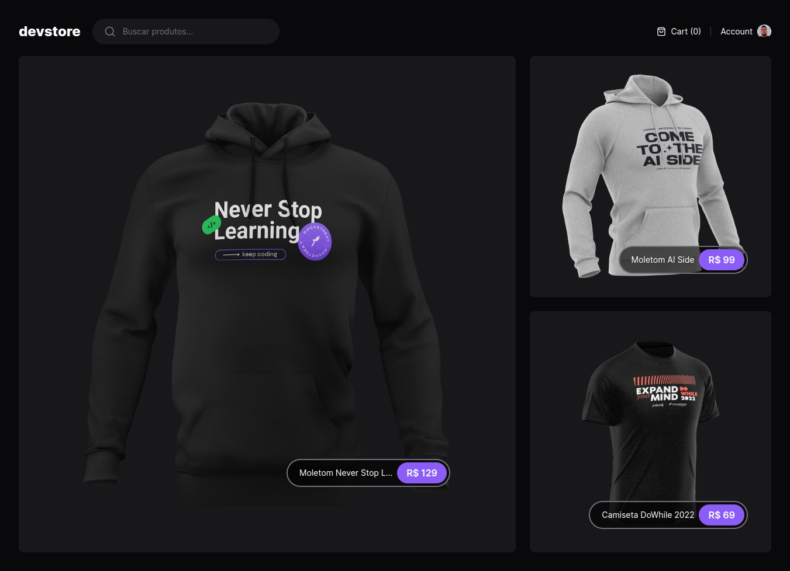
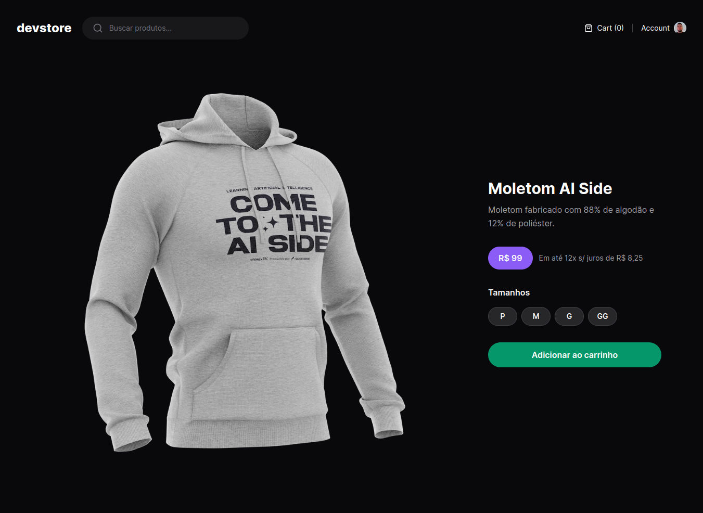

# Sobre o projeto
Foi desenvolvido durante o período em que a plataforma da Rocketseat ficou disponível gratuitamente. Não consegui finalizar todas as aulas, porém acredito que as dicas que aprendi sobre Nextjs valem a pena ser compartilhadas.




# Como executar
#### Casa não tenha o pnpm:
```
npm install -g pnpm
```
#### Clone o projeto
```
git clone https://github.com/edmar229/devstore.git
pnpm install
pnpm run dev
```

# Nextjs
É um framework opinado, ou seja ele possui um conjunto de regras que devem ser seguidas.

1 - Roteamento baseado em arquivos. Todo arquivo com o nome *page.tsx* que estiver dentro da pasta *app* vai virar uma rota.

2 - Tudo que eu quiser que seja global(todas as páginas), deve ser colocado no arquivo **src/app/layout.tsx**.

3 - Se eu quiser omitir o nome de uma pasta na url, é só deixar o nome dessa pasta entre parenteses.

4 - Rotas dinâmicas, aquelas que aceitam parâmetros: Cria uma pasta com o nome entre colchetes. Para receber múltiplos parâmetros faz nesse modelo -> [...data], coloca os três pontos.

# Arquitetura
#### Server Side Rendering
1 - Quando o usuário acessa a aplicação, ele não acessa diretamente o frontend, ele vai para o BFF Next Server(Nodejs).

2 - Ao invés de carregar todo o frontend da plicação(SPA tradicional em React), o servidor nextjs vai carregar somente os assets(js, html, css) necessários específicos dessa tal rota.

3 - Se precisar de algum dado da API, o servidor nextjs também consegue buscar.

4 - Todos os componentes são por padrão server components.

5 - Usaremos os server components quando não for necessária a interação com o usuário. Componentes apenas visuais.

6 - Quando precisar de interação usaremos os client components.

7 - Para transformar um server component em um client component basta por essa linha no começo do arquivo:
```
'use-client'
```

8 - Um client component passa pelo processo de Hidratação.

9 - Hidratação: Pegar um HTML sem interação e adicionar interatividade com a ajuda do Javascript.

# Fetch de dados nos componentes
1 - O componente só é enviado quando ele termina de ser construído.

2 - Posso realizar operações de async e await no componente e ele só será renderizado quando essas operações forem concluídas. Dessa forma o servidor nextjs vai devolver para o cliente o frontend com os dados já prontos.

3 - Isso ajuda no SEO.

# Loading e Streaming SSR
#### Loading
1 - Quando criamos um arquivo **loading.tsx** na mesma pasta que um *page.tsx*, enquanto o componente da página não estiver pronto, o nextjs automaticamente irá exibir o conteúdo desse loading.

2 - Se o arquivo **loading.tsx** for criado na pasta raiz /src/app, ele irá valer para todas as páginas que possuem operações assíncronas.

3 - O componente nextjs sempre vai pegar o **loading.tsx** que estiver mais próximo dele.

#### Streaming + SSR
1 - Renderizar um componente pelo lado do servidor de forma parcial.

2 - Trazer os dados de forma parcial(loading) e depois os dados completos da API.